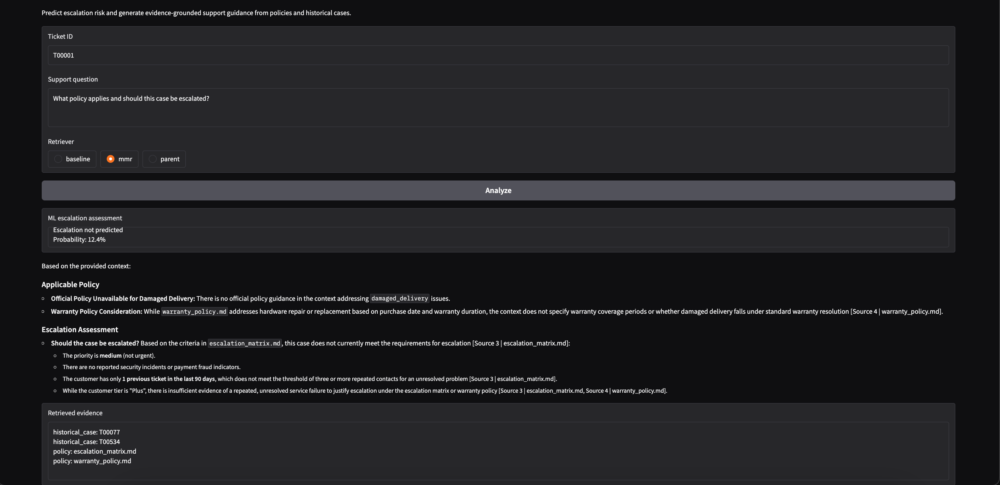

# Support Resolution Intelligence

A hybrid customer-support decision system that combines structured machine learning with retrieval-augmented generation (RAG) to estimate escalation risk and produce evidence-grounded support guidance.

The project keeps two decision paths intentionally separate:

- **XGBoost classification** predicts the probability that a support ticket will escalate.
- **RAG over support policies and resolved cases** retrieves relevant evidence and generates grounded guidance.

Both paths are orchestrated explicitly in Python and surfaced through a Gradio interface.

---

## Demo



The interface accepts a ticket ID, a support question, and a retrieval strategy, then returns:

- an ML escalation assessment;
- grounded support guidance;
- the retrieved evidence supplied to the LLM.

---

## Overview

Customer-support decisions often require two different kinds of information.

Structured ticket, customer, and product attributes can help estimate **escalation risk**, while policy documents and historical cases provide the **evidence needed to decide what support should do next**.

This project models those as separate responsibilities rather than forcing both into one model.

```text
                         Support Resolution Intelligence
                                      │
                             Ticket ID + Question
                                      │
                         ┌────────────┴────────────┐
                         │                         │
                         ▼                         ▼
                    Structured Data           Ticket Context
                         │                         │
                         ▼                         ▼
                     SQLite JOIN              MMR Retrieval
                         │                         │
                         ▼                         ▼
                    Preprocessing                Chroma
                         │                         │
                         ▼                         ▼
                       XGBoost              Retrieved Evidence
                         │                         │
                         ▼                         ▼
                 Escalation Probability          Gemini
                         │                         │
                         │                         ▼
                         │               Grounded Recommendation
                         │                         │
                         └────────────┬────────────┘
                                      ▼
                                   Gradio
```

The application uses **deterministic application orchestration**, not an autonomous agent layer.

---

## Key Features

### Structured ML pipeline

- SQLite-backed ticket, customer, and product data
- relational joins for model-ready features
- missing-value imputation
- numeric and categorical preprocessing
- one-hot encoding for categorical features
- XGBoost classification
- stratified train/test split
- five-fold stratified cross-validation
- probability-based escalation predictions
- explicit leakage prevention

### Advanced RAG pipeline

- official policy documents plus historical resolved cases
- parent-document ingestion
- recursive child chunking
- local sentence-transformer embeddings
- persistent Chroma vector storage
- baseline similarity retrieval
- Maximal Marginal Relevance (MMR) retrieval
- parent-aware retrieval
- labeled retrieval evaluation
- grounded Gemini generation
- programmatic evidence tracking

### Grounding safeguards

The generation layer is designed to distinguish **official policy** from **historical precedent**.

The prompt instructs the model to:

- use only the retrieved context;
- treat official policy documents as authoritative;
- treat historical cases as examples rather than policy;
- prefer policy when policy and historical precedent conflict;
- state clearly when relevant policy evidence is unavailable;
- avoid inventing eligibility rules, timelines, or escalation requirements.

The application also excludes outcome information from the live ticket context supplied to RAG.

---

## Dataset

All data used in this project is synthetic.

| Dataset | Records |
|---|---:|
| Customers | 180 |
| Products | 12 |
| Support tickets | 720 |
| Historical resolved cases | 140 |
| Policy documents | 9 |
| Retrieval evaluation queries | 12 |

The ticket dataset has an escalation rate of approximately **32.9%**.

### Knowledge base

The policy corpus covers:

- account security;
- damaged deliveries;
- escalation rules;
- payment disputes;
- returns and refunds;
- shipping delays;
- subscriptions;
- technical support;
- warranties.

Historical resolved tickets are stored separately and tagged as `historical_case` sources.

---

## Machine Learning Pipeline

### Modeling frame

The structured modeling dataset joins:

```text
tickets
   │
   ├── customers
   │
   └── products
```

The final model uses eight numeric and six categorical features.

### Numeric features

```text
sentiment_score
previous_tickets_90d
days_since_purchase
account_age_months
total_orders
lifetime_value
warranty_months
unit_price
```

### Categorical features

```text
channel
priority
issue_type
region
customer_tier
category
```

### Leakage prevention

The model predicts escalation risk using information available around ticket intake.

The following outcome or post-intake fields are deliberately excluded from model features:

```text
first_response_minutes
resolution_hours
resolution_text
```

The `escalated` field is used only as the prediction target.

The same principle is applied to the RAG path: outcome fields are not included in the live ticket context passed to the language model.

---

## ML Results

The XGBoost pipeline was evaluated using an **80/20 stratified train/test split** and **five-fold stratified cross-validation**.

### Cross-validation

| Metric | Result |
|---|---:|
| Mean ROC-AUC | **0.6913** |
| Standard deviation | **0.0364** |

### Held-out test set

| Metric | Result |
|---|---:|
| ROC-AUC | **0.7197** |
| Accuracy | **0.72** |

Classification performance:

| Class | Precision | Recall | F1 |
|---|---:|---:|---:|
| Not escalated | 0.76 | 0.84 | 0.80 |
| Escalated | 0.58 | 0.47 | 0.52 |

Confusion matrix:

```text
[[81, 16],
 [25, 22]]
```

The model provides a useful but imperfect escalation-risk signal. In particular, recall for escalated cases is weaker than performance for non-escalated tickets, so the prediction is best treated as **decision support rather than an automated final decision**.

---

## RAG Pipeline

### 1. Parent documents

The knowledge corpus contains:

```text
9 official policy documents
+
140 historical resolved cases
=
149 parent documents
```

Metadata distinguishes two source types:

```text
policy
historical_case
```

### 2. Chunking

Documents are split with `RecursiveCharacterTextSplitter` using:

```text
chunk size:    550
chunk overlap: 90
```

Each child chunk retains its parent metadata and child index.

### 3. Embeddings

The project uses:

```text
sentence-transformers/all-MiniLM-L6-v2
```

Embeddings are normalized and generated locally.

### 4. Vector storage

Child chunks are stored in a persistent Chroma collection.

Document IDs are deterministic, based on the parent ID and child index, so the index can be rebuilt consistently.

### 5. Retrieval strategies

Three retrieval strategies were implemented and compared.

#### Baseline similarity

Standard similarity search from Chroma.

#### Maximal Marginal Relevance

MMR balances relevance with diversity.

Configuration:

```text
k = 4
fetch_k = 12
lambda_mult = 0.6
```

#### Parent-aware retrieval

Relevant child chunks are retrieved first, deduplicated by parent ID, and then mapped back to full parent documents.

---

## Retrieval Evaluation

Retrieval quality was measured on a labeled benchmark of **12 support queries**.

Two metrics were used:

- **Recall@4** — whether the expected source appears in the top four results;
- **MRR** — how highly the expected source is ranked.

| Strategy | Recall@4 | MRR |
|---|---:|---:|
| Baseline similarity | 0.833 | 0.715 |
| **MMR** | **0.917** | **0.778** |
| Parent-aware | 0.833 | 0.715 |

MMR performed best on this evaluation set and is therefore the default retrieval strategy in the application.

The benchmark is intentionally small and synthetic, so these results are useful for comparing the implemented retrieval strategies rather than claiming broad real-world retrieval performance.

---

## Grounded Generation

Retrieved evidence is formatted with both source name and source type before being passed to the LLM.

Example:

```text
[Source 1 | policy | escalation_matrix.md]
...

[Source 2 | historical_case | T00534]
...
```

The generation layer currently supports:

- **Gemini** as the default provider;
- **Ollama** as an optional local fallback.

The application returns generated guidance separately from the retrieved evidence:

```python
{
    "answer": "...",
    "sources": [
        {
            "source": "escalation_matrix.md",
            "source_type": "policy",
        }
    ],
}
```

This means evidence tracking does not depend entirely on citations generated by the language model.

---

## Runtime and Latency Design

The application includes a few practical optimizations for interactive use:

- the Chroma vector store and local embedding model are reused across requests;
- the Gemini client is reused within the running application;
- Gemini uses a low thinking level for lower-latency support guidance;
- request timeout and retry limits prevent a slow external API call from blocking the UI indefinitely;
- input validation runs before expensive retrieval or generation steps.

The ML path is local and typically much faster than the generation path. External LLM latency can still vary depending on network and API conditions.

---

## SQL Analysis

The project includes five SQL analyses over the structured support data:

1. escalation rate by issue type;
2. escalation rate by customer tier and product category;
3. issue-type escalation rankings within each region;
4. monthly ticket volume and escalation rate;
5. customers with at least three tickets and above-average escalation rates.

The queries are available in:

```text
sql/analysis_queries.sql
```

---

## Project Structure

```text
support-resolution-intelligence/
├── data/
│   ├── raw/
│   │   ├── customers.csv
│   │   ├── products.csv
│   │   └── tickets.csv
│   │
│   ├── knowledge/
│   │   ├── account_security_policy.md
│   │   ├── damaged_delivery_policy.md
│   │   ├── escalation_matrix.md
│   │   ├── payment_dispute_policy.md
│   │   ├── return_refund_policy.md
│   │   ├── shipping_delay_policy.md
│   │   ├── subscription_policy.md
│   │   ├── technical_support_policy.md
│   │   ├── warranty_policy.md
│   │   └── resolved_cases.csv
│   │
│   ├── evaluation/
│   │   └── retrieval_eval.csv
│   │
│   └── DATA_PROFILE.json
│
├── sql/
│   └── analysis_queries.sql
│
├── artifacts/
│   └── .gitkeep
│
├── screenshots/
│   └── support-resolution-demo.png
│
├── app.py
├── config.py
├── database.py
├── llm.py
├── ml_model.py
├── rag_answer.py
├── rag_eval.py
├── rag_index.py
├── retriever.py
│
├── .env.example
├── .gitignore
├── requirements.txt
└── README.md
```

Generated runtime artifacts such as the SQLite database, trained model, and Chroma index are excluded from version control.

---

## Tech Stack

### Data and machine learning

- Python
- Pandas
- SQLite
- scikit-learn
- XGBoost
- Joblib

### Retrieval and generation

- LangChain
- Sentence Transformers
- Chroma
- `all-MiniLM-L6-v2`
- Gemini
- Ollama

### Interface

- Gradio

---

## Setup

### 1. Clone the repository

Clone the parent repository containing this project, then move into the project directory:

```bash
cd support-resolution-intelligence
```

### 2. Create a Python environment

Python 3.12 is recommended.

```bash
python3.12 -m venv .venv
source .venv/bin/activate
```

### 3. Install dependencies

```bash
pip install -r requirements.txt
```

### 4. Configure environment variables

Copy the example environment file:

```bash
cp .env.example .env.local
```

For Gemini:

```env
LLM_PROVIDER=gemini
GEMINI_API_KEY=your_api_key_here
GEMINI_MODEL=gemini-3.8-flash
GEMINI_THINKING_LEVEL=low
EMBEDDING_MODEL=all-MiniLM-L6-v2
```

`.env.local` is excluded from version control.

To use Ollama instead:

```env
LLM_PROVIDER=ollama
OLLAMA_MODEL=llama3.2:3b
```

### 5. Build the SQLite database

```bash
python database.py
```

This loads the raw CSV files into the local SQLite database and creates indexes used by the project.

### 6. Train the escalation model

```bash
python ml_model.py
```

This trains the preprocessing + XGBoost pipeline, evaluates it, and stores the generated model artifact locally.

### 7. Cache the embedding model if needed

The application loads the embedding model in local-only mode during indexing and retrieval. On a fresh machine, cache it once first:

```bash
python - <<'PY'
from sentence_transformers import SentenceTransformer

SentenceTransformer("all-MiniLM-L6-v2")
PY
```

### 8. Build the vector index

```bash
python rag_index.py
```

This creates the local persistent Chroma index from policies and resolved support cases.

### 9. Optional: evaluate retrieval

```bash
python rag_eval.py
```

This compares baseline similarity, MMR, and parent-aware retrieval using Recall@4 and MRR.

### 10. Launch the application

```bash
python app.py
```

Open the local Gradio URL shown in the terminal.

---

## Example Workflow

Given a ticket and a question such as:

```text
What policy applies and should this case be escalated?
```

The application:

1. retrieves the structured ticket from SQLite;
2. selects only pre-outcome features;
3. predicts escalation probability with XGBoost;
4. builds a safe textual ticket context;
5. retrieves policy and case evidence using the selected strategy;
6. sends the retrieved evidence and ticket context to the LLM;
7. returns grounded guidance and the retrieved evidence list.

The ML prediction and RAG recommendation remain independent signals rather than one being silently fed into the other.

---

## Design Decisions

### Why separate ML and RAG?

Escalation prediction and policy guidance solve different problems.

The ML model estimates risk from structured historical patterns. RAG answers support questions from documentary evidence.

Keeping the two paths separate makes their behavior easier to evaluate, debug, and explain.

### Why MMR?

Similarity retrieval can return highly overlapping results. MMR improves diversity while preserving relevance and produced the strongest result on the labeled retrieval benchmark used in this project.

### Why distinguish policies from historical cases?

A previous support resolution is not automatically a valid policy.

Historical cases therefore provide examples and precedent, while official policy documents remain authoritative.

### Why not use an agent?

The workflow is deterministic:

```text
load ticket
→ predict risk
→ retrieve evidence
→ generate guidance
→ display results
```

There is no need for an LLM to autonomously decide which tools to invoke. Adding an agent would increase complexity without solving a requirement of this project.

---

## Limitations

This project is a learning-focused prototype built on synthetic data.

Current limitations include:

- only 720 structured support tickets;
- a 12-query retrieval benchmark;
- moderate ML performance, especially for escalated-case recall;
- no calibrated or business-optimized classification threshold;
- no learned reranker;
- no similarity-based rejection threshold for out-of-domain retrieval;
- external API latency when Gemini is selected;
- synthetic policies and historical cases;
- no production authentication, observability, audit logging, or deployment layer.

The system should therefore be interpreted as a demonstration of **hybrid ML + RAG system design**, not a production customer-support decision engine.

---

## Possible Extensions

Potential follow-up work includes:

- threshold tuning for escalation classification;
- systematic false-negative analysis;
- probability calibration;
- metadata-filtered retrieval;
- query rewriting or multi-query retrieval;
- learned reranking;
- similarity-based rejection for out-of-domain questions;
- a larger retrieval evaluation set;
- deployment and observability;
- comparison with alternative vector stores or embedding models.

These are intentionally left outside the core implementation so the project remains focused on the evaluated ML and RAG architecture.

---

## What This Project Demonstrates

This project demonstrates how structured predictive modeling and retrieval-augmented generation can coexist in one application without blurring their responsibilities.

It covers:

- relational data engineering;
- SQL analytics;
- leakage-aware ML design;
- reusable preprocessing pipelines;
- XGBoost training and evaluation;
- local embedding generation;
- persistent vector indexing;
- multiple retrieval strategies;
- quantitative RAG evaluation;
- evidence-grounded generation;
- programmatic source tracking;
- latency-aware application design;
- Gradio integration.

The result is a complete hybrid workflow that turns structured support data and documentary evidence into two complementary outputs: **escalation risk** and **grounded resolution guidance**.
