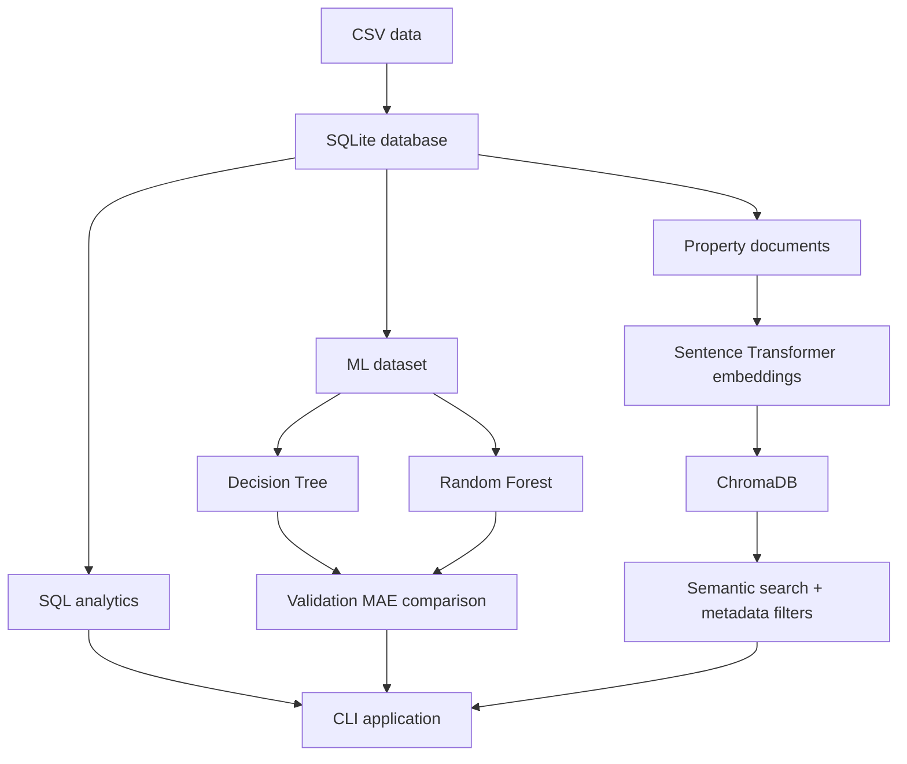
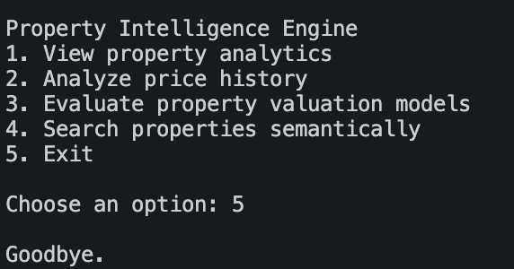
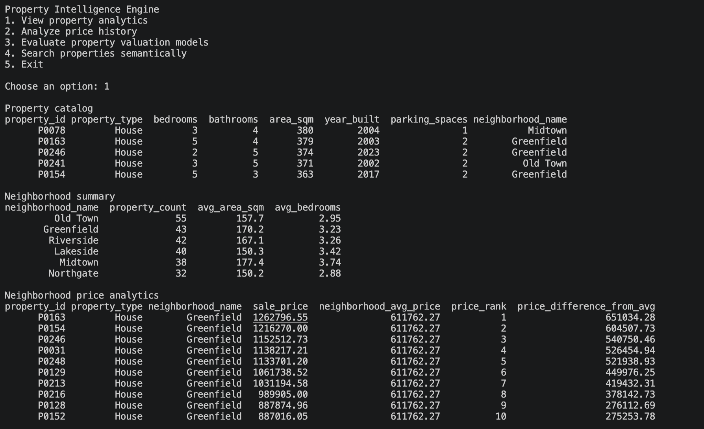
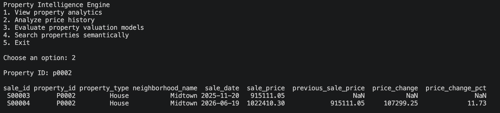
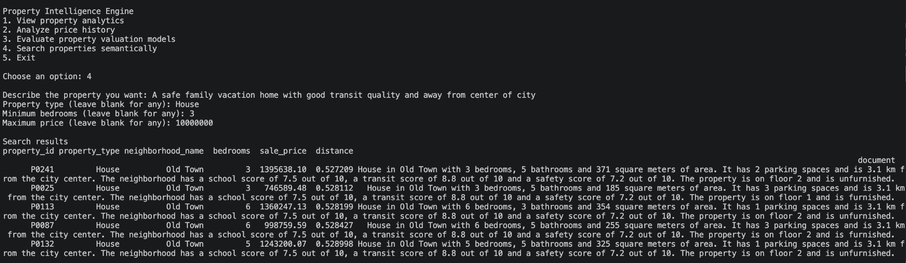

# Property Intelligence Engine

A local property intelligence application that combines **advanced SQL analytics**, **machine learning valuation**, and **semantic vector search** in one lightweight Python project.

The project works on a synthetic real-estate dataset and demonstrates how different data systems solve different classes of problems: SQL for exact analytics, supervised learning for price estimation, and embeddings for natural-language retrieval.

## What it does

The application provides four user-facing capabilities from a single CLI:

- **Property analytics** — browse property inventory, summarize neighborhoods, and compare current property prices within each neighborhood.
- **Historical price analysis** — inspect sale history and calculate absolute and percentage price changes from previous transactions.
- **Property valuation modeling** — tune a Decision Tree, train a Random Forest, evaluate both on the same validation split, and compare MAE.
- **Semantic property search** — search properties with natural language and combine semantic similarity with exact filters such as property type, minimum bedrooms, and maximum price.

## Why this project

Property data is not one problem with one ideal tool.

A query such as **"houses with at least 3 bedrooms under 700,000"** is structured and is best handled with exact filtering. A request such as **"a spacious family home with parking in a safe area near good schools"** is semantic and is better handled with embeddings. Predicting a property's sale price is a supervised learning problem.

This project keeps those responsibilities separate and then integrates them behind one application flow.

## Architecture



The application keeps each concern in a small dedicated module:

```text
main.py
   ├── database setup and application flow
   ├── SQL analytics coordination
   ├── ML evaluation coordination
   └── semantic search interaction

src/
   ├── database.py       SQLite setup and connections
   ├── sql_analytics.py  relational analytics and window queries
   ├── ml_model.py       feature preparation, training and evaluation
   └── vector_store.py   documents, embeddings, ChromaDB and search
```

## Dataset

All data in this repository is **synthetic** and is intended for learning and demonstration.

| Dataset | Rows | Purpose |
|---|---:|---|
| `neighborhoods.csv` | 6 | Neighborhood distance, school, transit, and safety attributes |
| `properties.csv` | 250 | Property characteristics such as type, bedrooms, area, parking, floor, and furnishing |
| `sales.csv` | 485 | Historical property transactions from 2024 through 2026 |

A property can have multiple historical sales, so the project uses window functions to distinguish historical analysis from the latest-sale view used by valuation and semantic search.

## SQL analytics

The SQL layer uses SQLite and Pandas to answer exact relational and analytical questions.

Key techniques include:

- Multi-table `INNER JOIN` and `LEFT JOIN`
- Parameterized filtering
- CTEs
- `ROW_NUMBER()` for latest-sale selection
- `AVG() OVER (...)` for neighborhood-level comparisons without collapsing property rows
- `RANK()` for price ranking within neighborhoods
- `LAG()` for previous-sale comparisons and price-growth calculations

Examples of supported analysis include:

```text
Latest sale per property
Neighborhood average sale price
Property price rank within neighborhood
Difference from neighborhood average
Previous sale price
Absolute price change
Percentage price change
```

## Machine learning pipeline

The valuation pipeline builds one modeling observation per property using its latest recorded sale as the target.

### Features

The current model uses numeric features only:

```text
bedrooms
bathrooms
area_sqm
property_age
parking_spaces
floor
furnished
distance_to_center_km
school_score
transit_score
safety_score
```

`property_age` is derived from `year_built`, while identifiers and the target itself are excluded from the feature matrix.

### Validation

The dataset is split into:

```text
200 training properties
50 validation properties
```

Decision Tree complexity is evaluated across several `max_leaf_nodes` values using validation MAE. The best tree is then compared with a Random Forest on the **same validation set**.

With the current synthetic dataset and `random_state=1`:

| Model | Validation MAE |
|---|---:|
| Tuned Decision Tree (`max_leaf_nodes=50`) | 49,682.11 |
| Random Forest | 49,842.40 |

For this dataset, the tuned Decision Tree performs slightly better. The point of the comparison is not to assume that the more complex model wins, but to select models using held-out performance.

## Semantic property search

The vector-search pipeline converts every current property record into a natural-language document containing meaningful property and neighborhood information.

Example document shape:

```text
House in Riverside with 4 bedrooms, 3 bathrooms and 230 square meters of area.
It has 2 parking spaces and is 4.2 km from the city center...
```

Documents are embedded with `all-MiniLM-L6-v2` and stored in a persistent ChromaDB collection.

The search layer separates **semantic meaning** from **hard constraints**:

```text
"spacious family home near good schools"
        ↓
vector similarity

property_type = House
bedrooms >= 3
sale_price <= 700000
        ↓
metadata filtering
```

This allows natural-language relevance and exact eligibility rules to work together instead of asking embeddings to perform numeric filtering.

## Project structure

```text
property-intelligence-engine/
├── data/
│   ├── neighborhoods.csv
│   ├── properties.csv
│   └── sales.csv
├── src/
│   ├── __init__.py
│   ├── database.py
│   ├── sql_analytics.py
│   ├── ml_model.py
│   └── vector_store.py
├── screenshots/
│   ├── menu.png
│   ├── price-history.png
│   ├── property-analytics.png
│   └── semantic-search.png
├── main.py
├── requirements.txt
├── .gitignore
└── README.md
```

Generated runtime files such as the SQLite database, ChromaDB index, and Python cache files are not required in source control; the application recreates them locally.

## Tech stack

- **Python** — application logic and orchestration
- **Pandas** — tabular data handling and SQL result integration
- **SQLite** — relational storage and advanced SQL analytics
- **scikit-learn** — Decision Tree, Random Forest, train/validation split, and MAE evaluation
- **ChromaDB** — persistent vector storage and metadata filtering
- **Sentence Transformers** — local semantic embeddings using `all-MiniLM-L6-v2`

## Getting started

### 1. Clone the repository

```bash
git clone <your-repository-url>
cd property-intelligence-engine
```

### 2. Create and activate a virtual environment

macOS / Linux:

```bash
python -m venv .venv
source .venv/bin/activate
```

Windows:

```bash
python -m venv .venv
.venv\Scripts\activate
```

### 3. Install dependencies

```bash
pip install -r requirements.txt
```

The Sentence Transformer model may be downloaded on first use if it is not already available locally.

### 4. Run the application

```bash
python main.py
```

On first use, the application initializes the SQLite database and creates the persistent property vector index when needed.

## Application menu

```text
Property Intelligence Engine
1. View property analytics
2. Analyze price history
3. Evaluate property valuation models
4. Search properties semantically
5. Exit
```

## Application preview

The screenshots below are captured from actual CLI runs of the project. Model metrics are shown as text so the README stays aligned with the finalized model-selection logic.

### CLI menu



### Property analytics

The analytics view combines a property catalog, neighborhood-level summaries, and latest-sale price comparisons produced by the SQL layer.



### Historical price analysis

Historical analysis uses `LAG()` to compare each transaction with the previous sale of the same property and calculate absolute and percentage price changes.



### Property valuation models

With the finalized pipeline and `random_state=1`, the current validation results are:

```text
Best Decision Tree leaf nodes: 50
Decision Tree MAE: 49,682.11
Random Forest MAE: 49,842.40
Better model: Decision Tree
Random Forest improvement: -0.32%
```

### Semantic property search

Semantic search combines natural-language similarity with exact metadata filters for property type, minimum bedrooms, and maximum price.



### Example semantic search

```text
Describe the property you want: spacious family home with parking near good schools
Property type (leave blank for any): House
Minimum bedrooms (leave blank for any): 3
Maximum price (leave blank for any): 700000
```

The hard filters determine which properties are eligible, while vector similarity ranks the eligible results by semantic relevance.

## Design decisions

A few deliberate choices keep the project focused and understandable:

- **SQLite instead of a hosted database** — sufficient for a local analytical project while still supporting joins, CTEs, and window functions.
- **One latest sale per property for ML/search** — prevents properties with more transaction history from appearing multiple times in current-state workflows.
- **Validation MAE instead of training accuracy** — model selection is based on unseen observations rather than memorization of training data.
- **Numeric ML features only** — categorical encoding is intentionally left out of this introductory modeling stage.
- **Metadata for exact constraints** — bedrooms and price are filtered structurally instead of relying on vector similarity for numeric logic.
- **No LLM layer** — this project implements semantic retrieval, not RAG or agentic behavior. Those are separate concerns and are intentionally outside the scope here.

## Limitations

This is a learning-focused local system rather than a production real-estate platform.

- The dataset is synthetic and small.
- Property valuation uses a single train/validation split rather than cross-validation or a dedicated test set.
- Categorical variables such as property type and neighborhood name are not encoded into the ML model.
- The semantic documents are generated from structured attributes and do not use the richer free-text `description` or `amenities` fields from the source dataset.
- Search filters are supplied explicitly; the application does not use an LLM to extract structured constraints from natural language.
- No web API, authentication, monitoring, or deployment layer is included.

These are intentional scope boundaries rather than hidden production claims.

## Learning context

This project applies concepts learned through:

- **Kaggle — Advanced SQL**: joins, CTEs, window functions, navigation functions, ranking, and query design
- **Kaggle — Intro to Machine Learning**: Decision Trees, validation, MAE, underfitting/overfitting, and Random Forests
- **IBM / Coursera — Vector Databases for RAG: An Introduction**: embeddings, similarity search, ChromaDB, metadata filtering, and vector-based retrieval

The implementation combines those topics into one integrated system rather than treating them as isolated exercises.

## Repository note

The source CSV files are synthetic and safe to publish. Generated local database/index artifacts should remain untracked and can be recreated by running the application.
